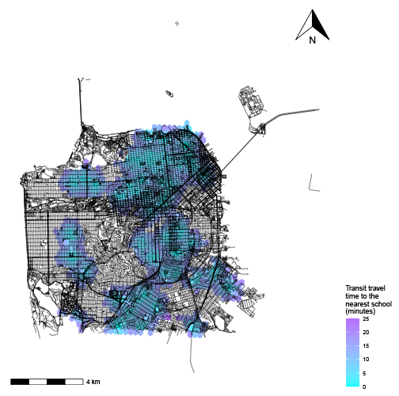
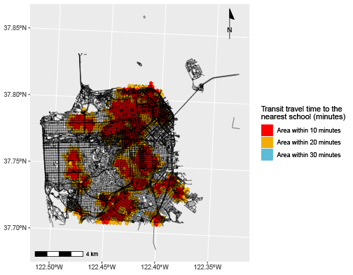
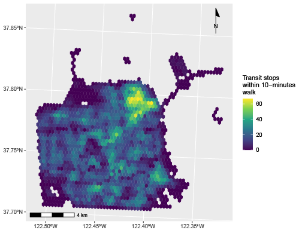
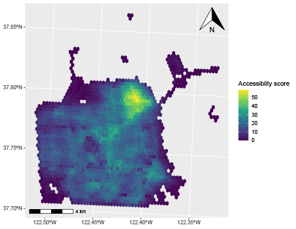
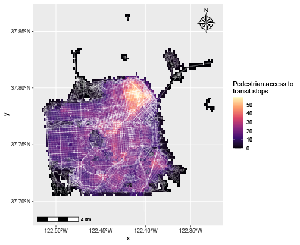
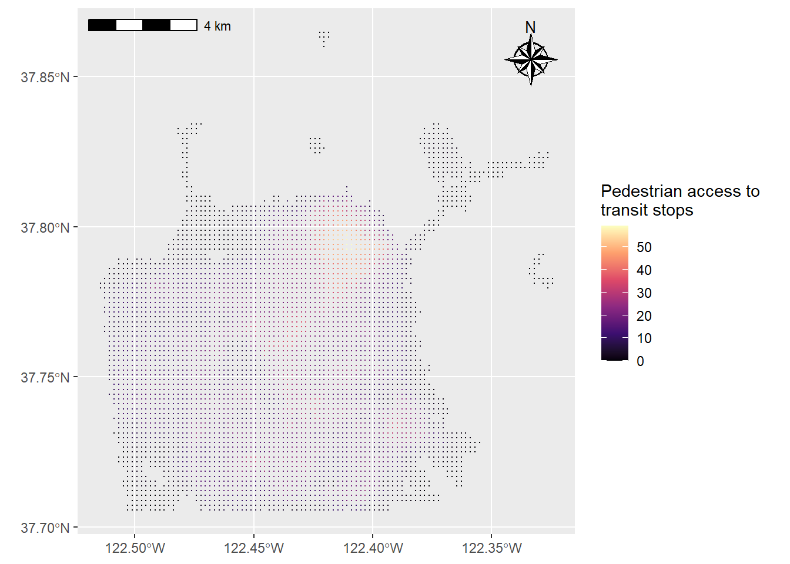
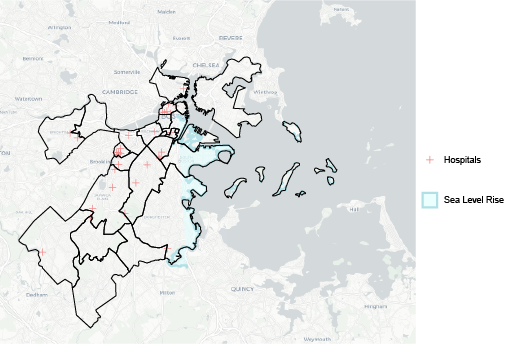
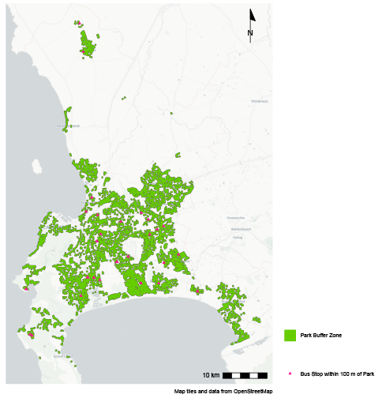
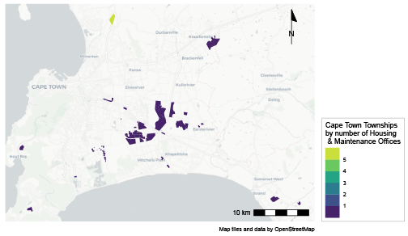

```{r setup, include=FALSE}
knitr::opts_chunk$set(echo = TRUE)
```

This is a portfolio of work demonstrating my spatial analysis competencies in R and ArcGIS. Skills demonstrated include

* Extracting data from the U.S. Census, OpenStreetMaps and open data portals
* Displaying data on interactive maps
* Calculating and displaying accessibility using travel time matrices, isochrones and decay functions
* Georeferencing raster images to digital spatial data
* Converting between raster layers and vector layers
* Aggregating point layers to polygons

# Interactive Maps & Census Data

## Public Assistance Recipients
The below map utilizes U.S. 2010 Census data to visualize the percent of Suffolk County, Long Island's population that receives public assistance in the form of cash or Supplemental Nutrition Assistance Program (SNAP or food stamps). Users can interact with the map on a census block scale to detemine what percentage of each block's total population receives public assistance.

[](https://mehvj.github.io/portfolio/fullsize/pub_assist.html){target="_blank"}

## Racial Demographics
This map uses U.S. 2010 Census data to illustrate Suffolk County, Long Island's population identifying as white alone. The interactive nature of the map allows the user to click on each census block to analyze this data on the block scale.

[](https://mehvj.github.io/portfolio/fullsize/inter_white.html){target="_blank"}

# Accessibility in San Francisco
The subsequent maps visualize accessibility of schools and public transit in San Francisco, California. For visual clarity and focused analysis, these maps only illustrate mainland San Francisco, excluding islands off the coast that are within the city limits.

## School Access
This map shows travel times to the nearest school in San Francisco by public transit and/or walking. I created this map by loading the city's GTFS transit feed, and street network and schools from OpenStreetMaps. After plotting this data, I created a grid of points, ran the r5r core and generated a travel time matrix calculating the travel time from each school to all the points in the grid. I then reshaped the matrix's data frame to merge it with the grid points to visually display the travel times on the below map.

[](https://mehvj.github.io/portfolio/fullsize/transit_time.pdf){target="_blank"}

## Creating Isochrones
Expanding on the previous map, the below visual displays isochrones of travel time to schools. I created the isochrones by subsetting the grid of points within bins of travel time values, and then combining polygons within each bin into a single polygon.

[](https://mehvj.github.io/portfolio/fullsize/ttime-iso1.pdf){target="_blank"}

## Transit Access
The below map displays the walkabe accessibility of transit stops in San Francisco using a distance-decay function. The function is based on the walking time to the nearest transit stop. Unlike the previous map of schools, instead of displaying if there is an amentiy within 10 minutes, this map displays how many you can reach within 10 minutes.

[](https://mehvj.github.io/portfolio/fullsize/transacc-iso1.pdf){target="_blank"}

## Transit Accessibility Score
This map similarly displays the walkable accessibility of transit stops, this time using an accessibility score. This representation was generated using a continuous decay function. The function assumes everyone has access to all transit stops in the geography, even if people have less access to the stops that are located further from them.

[](https://mehvj.github.io/portfolio/fullsize/access-score-iso.pdf){target="_blank"}

## Working with Different Types of Layers
The map below illustrates the same transit accessibility score, but uses a raster layer instead of a polygon layer. In addition, this map also overlays the city's street network. 

[](https://mehvj.github.io/portfolio/fullsize/access_score_raster.pdf){target="_blank"}

The below visual converts the raster layer to a vector layer.

[](https://mehvj.github.io/portfolio/fullsize/raster_tovector.pdf){target="_blank"}

# Georeferencing Historic Maps
This map illustrates the effects of sea level rise on the city of Venice, Italy. Projected over a georeferenced historic map of the city, this map identifies the buildings that would be most impacted by a 1-meter rise in sea level. The visualization reveals that many 20th century architectrue landmarks are vulnerable to flooding at 1m rise.

[](https://mehvj.github.io/portfolio/fullsize/VeniceMap.pdf){target="_blank"}

# Sea Level Rise in Boston
Using data from Analyze Boston, this map displays hospitals in Boston, Massachusetts and the areas affected by the 36-inch sea level rise predicted by 2070. The purpose of this map is to visualize hospitals in relation to flood risk areas to gain insight into an aspect of Boston’s health infrastructure resiliency.

[](https://mehvj.github.io/portfolio/fullsize/hospital-slr2.pdf){target="_blank"}

# Amenities in Cape Town
The below maps analyze the spatial distribution of amenities across Cape Town, South Africa's townships. The maps include point data (including Integrated Rapid Transit bus stops and Cape Town’s Housing and Maintenance Offices) and polygon layers (including parks and the boundaries of Less Formal Township Establishment Act (LFTEA) Areas). Established in 1991, the LFTEA designation allows for less formal residential settlement, speedier land development, and community regulation of land use for communal residential settlements. 

## Parks & Bus Stops
This map illustrates a 100-meter buffer zone around Cape Town's public parks and bus stops located within the buffer zone.

[](https://mehvj.github.io/portfolio/fullsize/park_buffer.pdf){target="_blank"}

## Housing & Maintenance Offices
The below map displays the number of Housing and Maintenance offices in each township within the city of Cape Town.

[](https://mehvj.github.io/portfolio/fullsize/office_poly.pdf){target="_blank"}